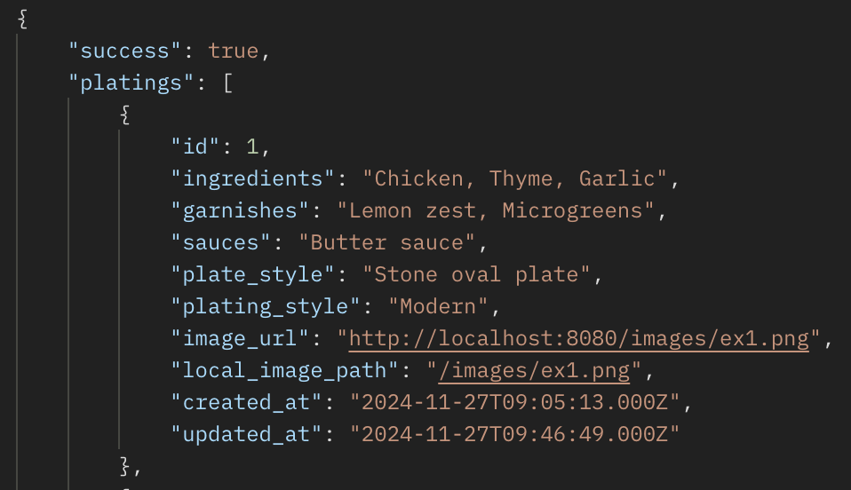
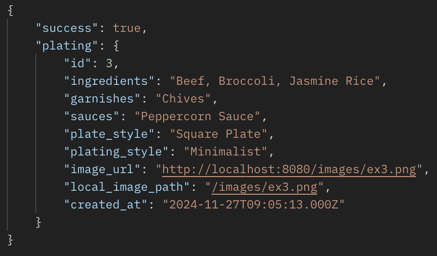
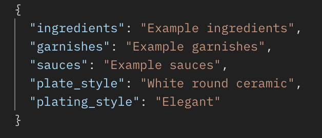
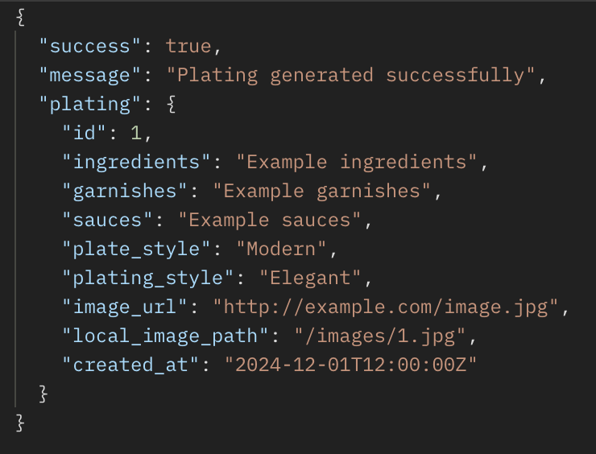
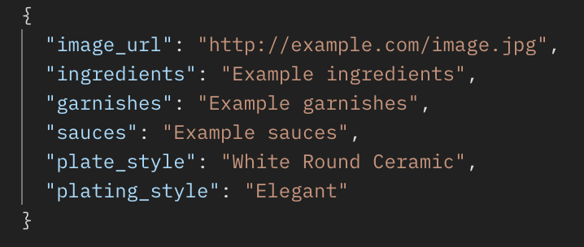
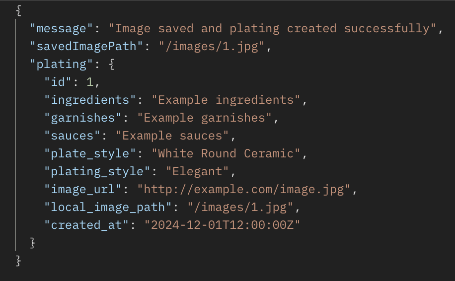

# PlatePal Server

PlatePal Server is the backend API for the PlatePal web application. It provides the necessary endpoints for creating, retrieving, and managing plate designs, including integrating with the OpenAI API for generating plating designs. This repository also contains database migrations and seed data setup for MySQL.

---

## Table of Contents
1. [Prerequisites](#prerequisites)
2. [Installation](#installation)
3. [Setup Instructions](#setup-instructions)
4. [Running the App](#running-the-app)
5. [API Endpoints](#api-endpoints)

---

## Prerequisites

Before you begin, ensure you have the following software installed:

- **Node.js** and **npm**: Node.js is required to run the server and install dependencies. 
  
- **MySQL**: PlatePal requires a MySQL database. 

- **OpenAI API Key**: PlatePal integrates with OpenAI to generate plating designs. 

---

## Installation

1. **Clone the repository**  
   Begin by cloning this repository:
    https://github.com/itsJuliet/platepal-server

2. Install dependencies
Run the following command to install all required dependencies:

        npm install

3. Create and configure the .env file
In the root directory, create a .env file with the following environment variables:

        DB_HOST=localhost
        DB_USER=your_mysql_user
        DB_PASSWORD=your_mysql_password
        DB_NAME=platepal
        OPENAI_API_KEY=your_openai_api_key
        NODE_ENV=development  
        //'development' will call the mock API for image generation 
        //Use 'production' to use OPEN AI API for real image generation

    Replace the placeholder values with your actual database credentials and OpenAI API key.

## Setup Instructions

You need to create a MySQL database for PlatePal. Once MySQL is set up, run the following commands to create the tables and seed the database:

        npm run db:migrate   
        npm run db:seed     

## Running the App
1. Start the server with:

        npm run dev 

    The server will now be running, and you can access it at http://localhost:8080 

## API Endpoints

Base URL: http://localhost:8080/api/platings

**Endpoints**
1. Get All Platings
URL: /gallery
Method: GET
Description: Fetches all platings from the database.
Response:

2. Get a Single Plating by ID
URL: /gallery/:id
Method: GET
Description: Fetches a specific plating by its ID.
URL Parameters:
id (integer): The ID of the plating.
Response:

3. Create a New Plating
URL: /gallery
Method: POST
Description: Creates a new plating and generates an image using OpenAI DALL·E.
Request Body:

Response:

4. Save Image to Gallery
URL: /save-image
Method: POST
Description: Saves AI generated image to the gallery.
Request Body:

Response:

5. Static Image Fetching
URL: /images/:filename
Method: GET
Description: Fetches static image files stored in the public/images directory.
URL Parameters:
filename (string): The name of the image file (e.g., example.png).

